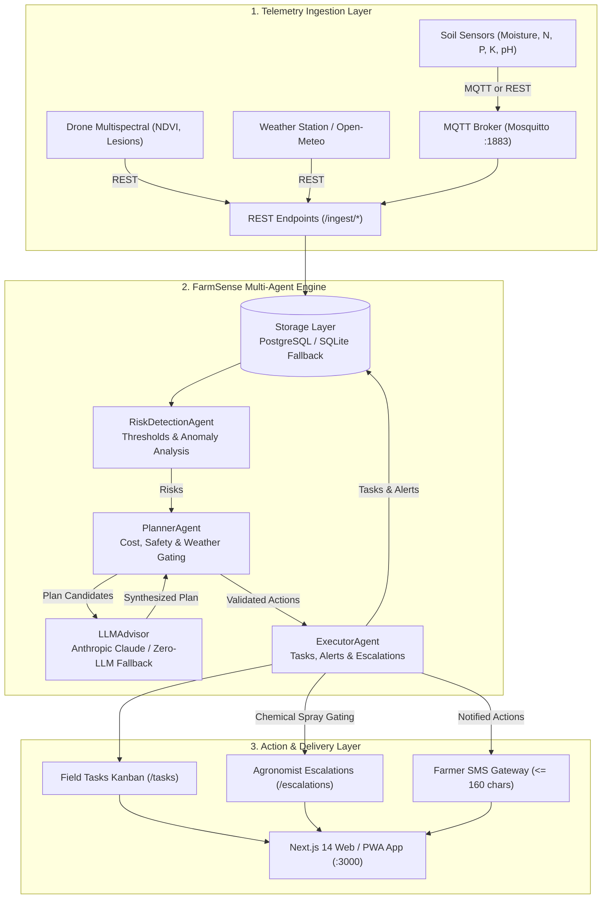

# FarmSense (Farm-to-Field)

> **Autonomous Multi-Agent Farm Advisory & Action Orchestration System for Smallholder Farmers in Rural & Low-Connectivity Regions**  
> *Hackathon Problem Statement PS-6 (Farm-to-Field)*

---

## 1. Overview & Problem Statement

Smallholder farmers in low-connectivity rural regions face compounding challenges: erratic weather patterns, sudden pest and fungal outbreaks, declining soil health, and restricted access to professional agricultural expertise. Most existing solutions either require persistent high-speed internet, depend heavily on cloud-only LLMs that fail during outages, or provide passive dashboards that lack automated action orchestration.

**FarmSense** is an autonomous, multi-agent farm advisory and execution platform engineered specifically for edge resiliency and human-in-the-loop safety. It ingests telemetry from soil moisture probes, weather stations, and drone multispectral imaging (via REST or lightweight MQTT), detects critical agronomic risks, synthesizes cost- and weather-constrained remediation plans, and orchestrates execution across feature-phone SMS feeds, field tasks, and agronomist escalations.

---

## 2. System Architecture



---

## 3. Core Safety & Operational Invariants

1. **Strict Chemical Spray Gating (`HTTP 409 Conflict`):**
   - Any action with `kind == "spray"` or `requires_expert_approval == True` is **never** permitted to reach status `notified` or `done` without an explicit, approved `Escalation` record signed off by an agronomist.
   - Calling `PATCH /tasks/{id}` with `{"status": "done"}` on an unapproved spray task strictly returns **`HTTP 409 Conflict`**.
   - No SMS alert authorizing chemical application is dispatched to the farmer until the escalation is approved.

2. **100% Deterministic Zero-LLM Fallback:**
   - FarmSense operates reliably with zero cloud dependencies. If `ANTHROPIC_API_KEY` is not provided or connectivity is lost, the `LLMAdvisor` automatically falls back to deterministic rule-based advice generation with zero latency and zero downtime.

3. **Dual-Mode Database Architecture:**
   - Production-ready PostgreSQL repository with automatic, zero-configuration SQLite fallback (`sqlite:///./farmsense.db`). Database migrations are version-controlled with Alembic.

4. **160-Character Feature-Phone SMS Constraints:**
   - All farmer alerts are dynamically formatted to strictly fit within standard 160-character single SMS limits, complete with actionable plot instructions, deadlines, and cost estimates.

5. **Weather & Budget Constraints:**
   - Actions are dynamically held or deferred based on forecast conditions (e.g., irrigation is skipped if >=12mm rain is forecast in 24h; urea fertilization is deferred 48h if heavy rain threatens nitrogen leaching).
   - Total planned remediation costs never exceed the farmer's configured budget (`budget_inr`).

---

## 4. Technology Stack

| Layer | Technologies |
|---|---|
| **Backend Framework** | Python 3.11+, FastAPI, Starlette, Uvicorn |
| **Persistence & ORM** | SQLAlchemy 2.0, Alembic, PostgreSQL (`asyncpg`/`psycopg2`), SQLite fallback |
| **Multi-Agent Engine** | Autonomous pipeline (`RiskDetectionAgent`, `PlannerAgent`, `LLMAdvisor`, `ExecutorAgent`, `Orchestrator`) |
| **Messaging & Ingestion** | Eclipse Mosquitto (MQTT v3.1.1/v5), Paho-MQTT, HTTPX |
| **Frontend & UI** | Next.js 14 (App Router), TypeScript, Tailwind CSS, Lucide Icons, Recharts, Framer Motion |
| **Mobile & Offline** | Progressive Web App (PWA), Service Worker offline cache, 48px minimum touch targets |
| **Containerization** | Docker, Docker Compose, Multi-stage builds |

---

## 5. Directory Structure

```text
farmsense/
├── alembic/                      # Database migrations
│   ├── env.py
│   └── versions/001_initial.py
├── app/                          # Modular FastAPI application
│   ├── agents/                   # Autonomous multi-agent pipeline
│   │   ├── advisor.py            # LLM advisor & deterministic fallback
│   │   ├── detection.py          # Agronomic risk detection
│   │   ├── executor.py           # Task creation & escalation router
│   │   ├── orchestrator.py       # Pipeline coordination & telemetry trace
│   │   └── planner.py            # Weather & budget constrained planner
│   ├── api/                      # REST API routers
│   │   ├── demo.py               # Seed / reset demo datasets
│   │   ├── escalations.py        # Agronomist review endpoints
│   │   ├── farms.py              # Farm, risk, and plan management
│   │   ├── ingest.py             # Telemetry ingest (soil, weather, drone)
│   │   ├── insights.py           # Dashboard stats & analytics
│   │   ├── orchestrate.py        # Run pipeline & fetch SMS alerts
│   │   └── tasks.py              # Task Kanban & status updates
│   ├── db/                       # Persistence layer
│   │   ├── repository.py         # SQLAlchemy store with caching & locks
│   │   └── session.py            # Engine & session factory (Postgres / SQLite)
│   ├── models/                   # Schemas & ORM
│   │   ├── orm.py                # SQLAlchemy declarative models
│   │   └── schemas.py            # Pydantic v2 schemas & validators
│   ├── services/                 # External integrations
│   │   ├── mqtt.py               # MQTT broker subscription listener
│   │   ├── notifier.py           # Safety-gated SMS notification service
│   │   └── weather.py            # Open-Meteo weather forecast client
│   ├── config.py                 # Pydantic Settings & environment config
│   └── main.py                   # FastAPI app instance & router mounting
├── frontend/                     # Next.js 14 App Router dashboard
│   ├── src/
│   │   ├── app/                  # 8 Application pages
│   │   │   ├── alerts/           # Feature-phone SMS feed
│   │   │   ├── dashboard/        # Soil & weather sensor charts
│   │   │   ├── escalations/      # Agronomist review & history
│   │   │   ├── plans/            # Timeline & cost gauge
│   │   │   ├── risks/            # Explain Reasoning drawer
│   │   │   ├── tasks/            # 4-Column Kanban with 409 spray gating banner
│   │   │   ├── trace/            # Multi-agent execution telemetry
│   │   │   └── page.tsx          # Landing & system overview
│   │   ├── components/           # Navigation, OfflineRibbon, StatCards
│   │   └── lib/                  # Typed API client with localStorage cache
│   ├── public/                   # PWA manifest & service worker
│   ├── Dockerfile
│   └── package.json
├── mosquitto/                    # MQTT broker configuration
│   └── mosquitto.conf
├── simulator/                    # End-to-end CLI telemetry simulator
│   ├── simulate.py               # 4 deterministic scenarios (drought, fungal, nutrient, rain)
│   └── README.md
├── tests/                        # Automated Pytest suite (35 tests)
│   ├── test_api_extended.py
│   ├── test_offline.py
│   ├── test_planner.py
│   ├── test_risks.py
│   ├── test_safety.py
│   └── test_simulator.py
├── docker-compose.yml            # Full-stack composition (API, Web, DB, MQTT)
├── Dockerfile                    # FastAPI backend container
├── main.py                       # Root entrypoint for uvicorn
├── requirements.txt              # Python dependencies
├── test_api.py                   # Root smoke test suite
└── README.md                     # Project documentation
```

---

## 6. Environment Variables Reference

| Variable | Default Value | Description |
|---|---|---|
| `FARMSENSE_ENV` | `development` | Environment mode (`development`, `production`, `test`) |
| `FARMSENSE_DB_URL` | `sqlite:///./farmsense.db` | SQLAlchemy database URI (PostgreSQL or SQLite) |
| `FARMSENSE_API_KEY` | `farmsense-dev-key` | Secret key required in the `X-API-Key` request header |
| `ANTHROPIC_API_KEY` | *(None)* | Optional Claude 3.5 API key; triggers zero-LLM fallback if omitted |
| `MQTT_HOST` | *(None / `mosquitto`)* | Hostname of Mosquitto broker (disables MQTT if unset) |
| `MQTT_PORT` | `1883` | Port for MQTT broker connection |
| `OPEN_METEO_URL` | `https://api.open-meteo.com/v1/forecast` | Open-Meteo weather API base URL |
| `CORS_ORIGINS` | `http://localhost:3000,http://127.0.0.1:3000` | Allowed origins for cross-origin requests |

---

## 7. Quickstart & Installation

### Option A: Docker Compose (Full Stack)

Ensure Docker and Docker Compose are installed:

```bash
# 1. Clone the repository and enter the directory
cd farmsense

# 2. Start all services (PostgreSQL, Mosquitto MQTT, FastAPI, Next.js Web)
docker compose up --build

# 3. Access the services:
#    - Web Application: http://localhost:3000
#    - FastAPI Docs:    http://localhost:8000/docs
#    - Mosquitto MQTT:  localhost:1883
```

---

### Option B: Local Non-Docker Development

#### 1. Backend Setup
```bash
# 1. Create and activate virtual environment
python -m venv venv
# Windows:
venv\Scripts\activate
# Linux/macOS:
source venv/bin/activate

# 2. Install dependencies
pip install -r requirements.txt

# 3. Run database migrations (creates SQLite tables automatically)
alembic upgrade head

# 4. Start the FastAPI server
uvicorn main:app --port 8000 --reload
```

#### 2. Frontend Setup
```bash
# In a separate terminal:
cd frontend
npm install
npm run dev
# App will be accessible at http://localhost:3000
```

---

## 8. Automated Test Suite

The test suite contains 35 comprehensive unit and integration tests verifying all domain invariants, safety gates, and multi-agent workflows.

```bash
# Run the complete test suite
pytest -v

# Run safety gating invariant tests specifically
pytest tests/test_safety.py -v

# Run simulator scenario tests
pytest tests/test_simulator.py -v
```

---

## 9. 3-Minute Evaluation Walkthrough

Follow this step-by-step evaluation walkthrough to witness all autonomous agent capabilities in under 3 minutes:

### Step 1: Ingest Critical Drought Telemetry
Run the telemetry simulator in drought scenario:
```bash
python simulator/simulate.py --scenario drought --farm-id farm-demo --rest-only
```
- **Detection Agent**: Identifies `water_stress` (Soil moisture 10% in plot-1, score 95).
- **Planner Agent**: Synthesizes early-morning irrigation plan (`cost ~Rs250`).
- **Executor Agent**: Emits pending task and dispatches single-SMS notification (`<= 160 chars`).

### Step 2: Trigger Fungal Outbreak & Safety Escalation
```bash
python simulator/simulate.py --scenario fungal --farm-id farm-demo --rest-only
```
- **Detection Agent**: Detects wet canopy, humidity 88%, and drone NDVI lesion drop.
- **Planner Agent**: Proposes two scouting actions and one chemical fungicide spray.
- **Invariant In Effect**: The fungicide spray action is flagged with `requires_expert_approval = True`. An `Escalation` record is generated in `pending` state. **No SMS is sent to the farmer authorizing the spray.**

### Step 3: Verify the Chemical Spray Safety Gate (HTTP 409)
Attempt to mark the chemical spray task as `done` without agronomist sign-off:
```bash
# Replace <TASK_ID> with the spray task ID returned from /farms/farm-demo/tasks
curl -X PATCH http://localhost:8000/tasks/<TASK_ID> \
  -H "X-API-Key: farmsense-dev-key" \
  -H "Content-Type: application/json" \
  -d "{\"status\": \"done\"}"
```
- **Result**: Server returns **`HTTP 409 Conflict`**:  
  `{"detail": "Action <ACT_ID> (spray) requires an approved expert Escalation before 'done'."}`

### Step 4: Agronomist Escalation Approval
Approve the pending escalation via the expert endpoint (or from the `/escalations` UI page):
```bash
# Replace <ESC_ID> with the escalation ID from /escalations?farm_id=farm-demo
curl -X POST http://localhost:8000/escalations/<ESC_ID>/resolve \
  -H "X-API-Key: farmsense-dev-key" \
  -H "Content-Type: application/json" \
  -d "{\"approved\": true, \"advice\": \"Leaf blight verified. Approved for spray under 15 kph wind.\"}"
```
- **Result**: Escalation transitions to `approved`.
- **Executor Agent**: Automatically dispatches the approved chemical spray SMS alert to the farmer!
- Now re-running the `PATCH /tasks/<TASK_ID>` call succeeds with **`HTTP 200 OK`**!

### Step 5: Test Rain Deferral & Hold Lifting
```bash
# 1. Trigger high water stress during 30mm rain forecast
python simulator/simulate.py --scenario rain_deferral --farm-id farm-rain --rest-only

# Notice: Irrigation and fertilization actions are placed on HOLD (weather constraint)
# No premature tasks created; farmer receives postponement SMS.

# 2. Clear rain forecast to lift hold
python simulator/simulate.py --scenario rain_deferral --farm-id farm-rain --clear-rain --rest-only

# Notice: Holds are lifted; irrigation and split-dose urea tasks are immediately emitted!
```

---

## 10. Frontend Overview & Pages

The frontend is built with Next.js 14 App Router, styled in an earthy-modern palette (`#14532D` Forest Green, `#4ADE80` Leaf, `#FBF7EE` Warm Wheat) with 48px minimum touch targets for field accessibility:

1. **`/` (Home / Overview)**: System status, active farm selector, quick-links to all workflows.
2. **`/dashboard` (Sensors & Weather)**: Real-time 48-hour moisture, temperature, and rainfall trend charts.
3. **`/risks` (Risk Detection)**: Visual severity badges (Critical, High, Medium) with an interactive "Explain Reasoning" slide-over drawer detailing the raw sensor evidence.
4. **`/plans` (Action Plans)**: Action timeline, cost progress gauge vs. farm budget, and weather constraint rationales.
5. **`/tasks` (Task Kanban)**: 4-column drag-ready Kanban (`pending`, `in_progress`, `done`, `overdue`) with inline chemical spray gating warnings and one-tap status toggles.
6. **`/escalations` (Agronomist Portal)**: Review queue for high-risk chemical sprays, approval / rejection actions with custom agronomic advice notes, and audit history.
7. **`/trace` (Agent Execution Trace)**: Live multi-agent pipeline inspection showing execution latency, input/output summaries, and token counts.
8. **`/alerts` (SMS Feed)**: Feature-phone simulation feed displaying exact SMS text messages with 160-character count indicators.

---

## 11. Offline & Low-Connectivity Resiliency

- **Service Worker Caching**: The web dashboard registers a service worker caching application assets and recent data for offline review.
- **Client Cache Fallback**: `frontend/src/lib/api.ts` transparently caches the latest API responses in `localStorage`. If the network drops, an offline indicator ribbon appears and cached data is rendered without crashing.
- **SMS Priority**: Even when farmers lack data access, all mission-critical instructions are pushed via standard cellular SMS under 160 characters.

---

## 12. License

This project is open-source under the MIT License. Built for Hackathon PS-6 (Farm-to-Field).
---

## Live Project

Access the deployed FarmSense application here: [https://temp-off-by-one.vercel.app/](https://temp-off-by-one.vercel.app/)
